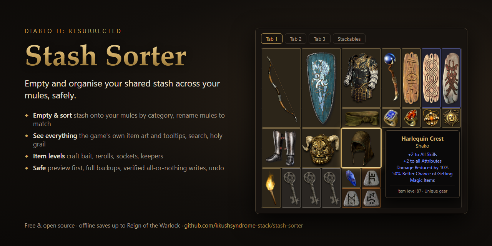

# Stash Sorter



Empty your **Diablo II: Resurrected** shared stash onto your mules — sorted by category, with mules renamed to
match what they hold — find any item across every character, track your holy grail, and see what your items'
**item levels** are good for (crafting, rerolling, sockets).

Works with offline (single-player) saves from D2R 1.0 through **Reign of the Warlock** (save versions 97–105).
Runs locally on your PC; nothing is uploaded anywhere.

## What it does

**Sort & distribute** (preview first, then apply):
- **Empty the shared stash** onto mules that already hold that kind of loot; empty mules get a new job.
- **Tidy up** — also move items that sit on the wrong mule, then pack each kind of loot onto as few mules as
  possible, emptying whole mules where everything fits elsewhere. Far fewer moves than a full re-sort.
- **Full re-sort** — lay out the stash and every mule again, category by category.
- **Bring the old stash forward** — move the Resurrected-era shared stash into the RotW one (forward only, like
  the game's character transfer). Gold stays where it is.
- **Rename mules** to match their contents (`CharmsOne`, `CraftBaitTwo`, …).
- **Test run** — move just 1 or 5 items, check in game, then do the rest.
- **Create new mules** when space runs out (experimental): copies an empty level-1 character without its items.
- **Stackables tab** (beta): move loose runes, gems and materials into the RotW Stackables tab.

**Session tracker:** leave Stash Sorter open while you play and press *Start session*. Every Save & Exit is
logged as a run: the loot you found (new holy-grail finds flagged), what left (sold, used, dropped), experience,
levels and gold gained, run times and runs per hour. Moving items between characters isn't counted as loot, and
your saves are only read. Finished sessions are kept in a `sessions` folder next to the app for later.

**Terror Zones:** in single-player/offline D2R the terror zone follows a fixed schedule based on your PC's
clock. Pick a zone and Stash Sorter moves the Windows clock to its most recent session (Windows asks for
permission each time; only that one step runs as administrator), then puts the real time back from
`time.windows.com` when you click *Revert* or close Stash Sorter. Shows the zone active right now with immunities,
boss packs and super uniques, what's coming up, and pins your favourite zones. Schedule from
[d2emu.com](https://d2emu.com/tz-sp), cached for offline use. (This was the stand-alone D2R Terror Zone Clock;
its favourites and saved schedule are picked up automatically.)

**Look around:**
- The game's own **item artwork** and **tooltips** ("+20% Faster Cast Rate", "Level 10 Life Tap (12/15 Charges)").
- **Find**: search every character and stash by name, stat or location ("shako", "faster cast", "CharmMule").
- **Collection**: which uniques and set items you own (and where), which are missing, runewords made.
- **Item levels**:
  - *Craft bait* (magic rings & amulets): the crafted item's level is ⌊crafter level ÷ 2⌋ + ⌊ingredient ilvl ÷ 2⌋;
    shows which top affixes a craft can still roll (e.g. amulets need affix level 90 for +2 class skills).
  - *Reroll* (charms & jewels): what "3 perfect gems + magic item" (which keeps the item level) can roll.
  - *Bases*: how many sockets the item level allows.
  - *Keep as-is*: flags magic items that already have the best tier of valuable affixes (e.g. a +3 skill tab
    amulet "of the Whale"), so they're filed with your jewelry instead of being thrown into the cube.
  - All thresholds come from the game's own tables.

**Clean up:**
- **Duplicates**: every unique and set item you have more than once, with each copy's stats side by side so you
  can keep the best roll and delete the rest.
- **Empty mules**: mules with nothing on them but their starting gear (no items, gold or mercenary). After a tidy
  up, the preview tells you which mules will be empty; delete the ones you don't need.
- Deleting is previewed, backed up, verified and undoable like everything else.

**Sorting rules** you can edit in the app: reorder categories, rename them, switch them off, or change their
conditions. Defaults: runes, gems, materials, rings & amulets, craft bait, unique charms (Anni/Torch/Gheed's/
Sunder — max one of each per character, enforced), junk charms, charms, jewels, runewords, uniques, sets,
rares, ethereal bases, bases, magic gear, everything else.

## Safety

Your save files are precious, so Stash Sorter is careful:

- **Preview first.** Nothing is written until you press *Apply* on a plan you've looked at.
- **Full backup** of the whole save folder (zip) before every change.
- **Undo** reverses exactly one change (as long as you haven't played those characters since); **Restore** puts
  the whole folder back to any backup.
- **Refuses to run while the game is open**, and refuses if a save changed since it was loaded.
- **Verifies every rebuilt file before writing**: each must re-read and re-write identically, every item must be
  accounted for bit-for-bit (only its position may change), nothing may overlap, carry-one rules must hold.
- **All-or-nothing writes**: files are prepared first, a journal is written, then they're swapped in and read back.
  If anything is interrupted or doesn't match, it rolls back to the backup automatically (or from the banner the
  next time you open the app).
- Items are **never re-encoded** — only their position bits change.
- The game install is only ever read.

Still: keep your own backups too, and use at your own risk. Only for offline characters.

## Getting started

**Easiest:** download `StashSorter.exe` from the [latest release](https://github.com/kkushsyndrome-stack/stash-sorter/releases/latest),
put it in a folder of its own, close Diablo II: Resurrected completely, and double-click it. Your browser opens the
app. (Backups and your rules are kept next to the exe.) Windows may warn about an unrecognised app because the exe
isn't code-signed: choose *More info → Run anyway*, or run from source instead.

**From source:** install [Python 3.9+](https://www.python.org/downloads/) (tick *Add python.exe to PATH*),
download this folder, and double-click **`Stash Sorter.bat`** — or run `python -m stash_sorter`.

### In the app

1. **Overview** — your characters. Ticked ones are used as mules (default: level-1 characters and anything with
   "mule" in the name that can use the stash). Untick anything you want left alone; click a row to look inside.
2. **Shared Stash** — click items you want to **keep** in the stash (⚑).
3. **Sort & Distribute** — pick a mode, **Preview plan**, check where things go, then **Apply**.
   New to it? Set *Test run* to "Just 1 item" first.
4. **Session** — start a session before you play; every Save & Exit shows up as a run.
   **Terror Zones** — pick a zone, set the clock, revert when you're done.
5. **Find**, **Collection**, **Item Levels** — browse and search.
6. **Clean Up** — delete duplicate uniques/sets you don't need, and empty mules.
7. **Sorting Rules** — change how items are categorised and what mules are called.
8. **Backups** — undo a change or restore a backup.

### Command line

```
python -m stash_sorter scan                                  # characters, stashes, gold
python -m stash_sorter plan --mode tidy --rename new         # preview (changes nothing)
python -m stash_sorter apply --mode stash --limit 1          # test run: move one item
python -m stash_sorter apply --mode stash --rename new       # do it (asks for confirmation)
python -m stash_sorter plan --mode migrate                   # old stash -> RotW stash
python -m stash_sorter find harlequin                        # where is my Shako?
python -m stash_sorter track                                 # session tracker in the terminal (Ctrl+C ends)
python -m stash_sorter tz                                    # current and upcoming terror zones
python -m stash_sorter dupes                                 # duplicate uniques/sets (with item keys)
python -m stash_sorter delete-items KEY [KEY ...]            # delete chosen copies (asks first)
python -m stash_sorter empty-mules                           # which mules are empty
python -m stash_sorter delete-mules NAME [NAME ...]          # delete empty mules (asks first)
python -m stash_sorter assess --kind craft --crafter-level 95
python -m stash_sorter backups / undo <log> / restore <zip> / recover
python -m stash_sorter rules [--load my_rules.json | --reset]
```

Useful options: `--saves <folder>` (e.g. a mod's save folder), `--mule-level N`, `--mules A,B,C`,
`--exclude A,B`, `--keep runes,gems`, `--stackables`, `--create-mules N`, `--backups <folder>`.
`StashSorter.exe` takes the same arguments.

## Good to know

- **Eras.** RotW characters use the RotW shared stash (`ModernSharedStash…`); Resurrected-era characters use the
  older stash. Items only move to characters that can use the selected stash.
- **Old saves** (e.g. v99) must be **logged in once** so the game upgrades them before they can receive items.
- **Mules without a Horadric Cube** get inventory (10×4) + personal stash (10×10).
- **Renaming** renames the character's `.d2s` and side files (`.ctl`, `.key`, `.ma*`, `.map`) and the name inside
  the save. Names must be 2–15 letters (one `-` or `_` allowed).

## Game data & artwork

Stash Sorter reads tables, strings and item artwork from your install when the game files have been extracted
(`Data/global/excel`, `Data/local/lng/strings`, `Data/hd/global/ui/items`). Mods: `--data-dir <mod>/data`.
Without extracted files it uses a small snapshot of the tables bundled in `stash_sorter/data/` (D2R 3.3.93847) and
draws coloured boxes instead of artwork. Refresh the snapshot after a patch with
`python -m stash_sorter build-gamedata`. Decoded artwork is cached in `%LOCALAPPDATA%\StashSorter\cache`.

## Development

```
python -m unittest discover -s tests -v     # tests
python tools/build_exe.py                   # builds dist/StashSorter.exe (isolated build environment)
```

`tests/test_fixtures.py` runs anywhere using the sample saves in `tests/fixtures/hlb` and the bundled game data.
`tests/test_saves.py` uses your own saves read-only (and asserts they're unchanged afterwards); all write paths run
on a temporary copy. Point it elsewhere with `D2R_TEST_SAVES=<folder>`.

Layout: `bits.py` (bit I/O) · `items.py` (item format) · `savefiles.py` (.d2s/.d2i) · `gamedata.py` (tables) ·
`describe.py` (tooltips) · `art.py` (sprites) · `catalog.py` (names) · `assessor.py` (item levels) · `rules.py`
(categories) · `planner.py` (where things go) · `apply.py` (the only module that writes) · `service.py` /
`server.py` / `web/` (GUI) · `cli.py`.

## License

MIT — see [LICENSE](LICENSE). The sample saves in `tests/fixtures/hlb` are from Horadric Loot Box (MIT, licence
included there).

## Credits

- Reign of the Warlock (v105) item layout and the sprite format were cross-checked against
  [Horadric Loot Box](https://github.com/pyrosplat/Horadric-Loot-Box) (MIT); its sample saves are used as test
  fixtures (`tests/fixtures/hlb`, MIT licence included).
- Item-code Huffman table first published by d07riv.

Diablo II: Resurrected is a trademark of Blizzard Entertainment. This project is not affiliated with Blizzard.
